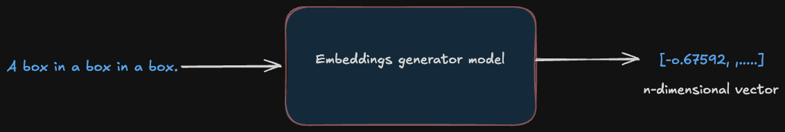
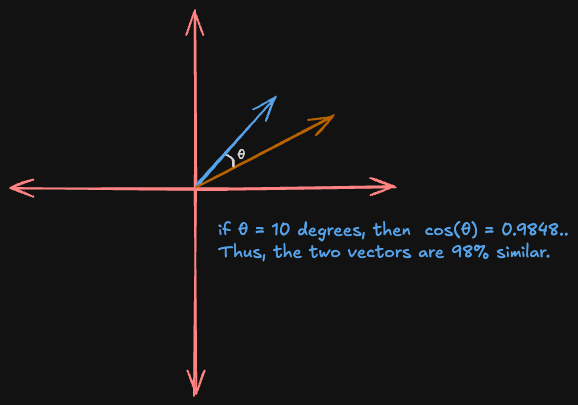

Building intuition for how machine learning models understand language is notoriously difficult. Embeddings, which are high-dimensional vectors that encode meaning, are somewhat opaque. LLMs also deal with higher dimensional spaces which are beyond our mental model of the 3D world. You can't exactly *look* at 768 dimensions.

So I tried to build a 3D visualization tool that allows exploration of how sentences relate to each other in a higher-dimensional semantic space.

[Latent Space Sampler](https://latent-space-sampler.streamlit.app/) takes two sentences, runs them through a sentence-transformer model, and plots their embedding vectors in an interactive 3D space. You can type in "Batman is Bruce Wayne" and "Superman is Clarke Kent," hit analyze, and watch two vectors materialize, pointing in almost the same direction. 

This post walks through the key ideas behind it: what embeddings actually are, how cosine similarity works (and why it's about *angles*, not distances), and the tricky problem of cramming 768 dimensions into 3 so that we can visualize it. 

## What Is an Embedding?

When a language model reads a sentence, it doesn't process words directly as these models don't really understand words as we do. The LLM converts input sentences into a dense vector. This is a list of floating-point numbers that encodes the representation of that sentence as a point in high-dimensional space. The key insight is that sentences with similar meanings end up *geometrically* close to each other in this space. That geometric structure is what makes embeddings so powerful: similarity in meaning becomes similarity in position, and that's something a machine can reason about.

For this project, I used the [all-mpnet-base-v2](https://huggingface.co/sentence-transformers/all-mpnet-base-v2) model from the `sentence-transformers` library to generate these embeddings. It's a 110M-parameter model fine-tuned on over a billion sentence pairs, and it produces 768-dimensional embeddings. That means every sentence you feed it comes back as 768 numbers:

```python
from sentence_transformers import SentenceTransformer

model = SentenceTransformer('all-mpnet-base-v2')
embeddings = model.encode(["Batman is Bruce Wayne", "Superman is Clarke Kent"])
# embeddings.shape -> (2, 768)
```

Each of those 768 numbers represents some learned feature of the sentence. These are not human-named features, but ones that the model discovered during training. Some might correlate loosely with sentiment, others with topic, others with syntactic structure. Most aren't easy to interpret on their own. But together, they place the sentence at a precise coordinate in a 768-dimensional space.

<br>
<br>




<br>


The important intuition: in this space, **meaning is proximity**. "The cat sat on the mat" and "A feline rested on the rug" will land near each other, while "Quarterly earnings exceeded projections" will be somewhere far away. The model has learned to organize language geometrically.

## Cosine Similarity

Now we have two sentences as two vectors in 768-dimensional space. How do we measure how similar they are?

The naive approach would be to use Euclidean distance where we just measure the straight-line gap between the two points. But this has a problem: it's sensitive to magnitude. A long vector and a short vector pointing in the *exact same direction* would register as "far apart" even though they represent the same meaning at different scales.

Cosine similarity solves this by ignoring magnitude entirely. It only cares about the **angle** between the two vectors. Two vectors pointing in the same direction have a cosine similarity of 1.0, regardless of how long they are. Two perpendicular vectors score 0. Two vectors pointing in opposite directions score -1.

The formula:

```
cos(θ) = (A . B) / (||A|| * ||B||)
```

The numerator is the dot product (sum of element-wise multiplications). The denominator normalizes by both vector magnitudes, effectively projecting everything onto the unit sphere. In code:

```python
cos_sim = np.dot(embeddings[0], embeddings[1]) / (
    np.linalg.norm(embeddings[0]) * np.linalg.norm(embeddings[1])
)
```



**Diagram: "Cosine Similarity"** -- *Two arrows from the origin in 2D. When the angle between them is small (say 10 degrees), cosine similarity is high (~0.98) -- the sentences mean similar things. When the angle is close to 90 degrees, cosine similarity drops to ~0 -- semantically unrelated.*

One design decision worth highlighting: in the app, **cosine similarity is computed on the full 768-dimensional embeddings**, not on the 3D-reduced coordinates. This is critical. The 3D plot is an approximation for human eyes; the similarity score is mathematically exact. Computing it after dimensionality reduction would introduce compounding information loss -- you'd be measuring a shadow of the real relationship.

## The Visualization Problem: 768 Dimensions Into 3

So we have two 768-dimensional vectors and a similarity score. But how do you *show* that to a human? We can perceive three spatial dimensions, and even that calls for an interactive 3D chart to do well.

This is where PCA (Principal Component Analysis) comes in. PCA answers the question: "If I could only keep 3 directions out of 768, which 3 would preserve the most information?"

It works by finding the axes along which the data varies the most. The first principal component is the direction of maximum variance. The second is the direction of maximum variance *orthogonal to the first*. And so on. By projecting our 768-d vectors onto the top 3 principal components, we get 3D coordinates that capture as much of the original structure as possible:

```python
from sklearn.decomposition import PCA

pca = PCA(n_components=3, random_state=42)
coords = pca.fit_transform(embeddings)  # (n, 768) -> (n, 3)
```


The caveat: PCA is a **lossy** projection. Two sentences that are very similar in 768 dimensions might appear slightly farther apart in 3D if most of their similarity lives in dimensions that PCA discards. That's another reason the cosine similarity score is computed before reduction - the number is the truth, the plot is the illustration.

## The Anchor Trick

Plotting two vectors in 3D doesn't tell you much on its own as it is just two arrows in an empty space. There's no frame of reference.

This is where **anchor sentences** come in. Three hardcoded phrases from wildly different semantic domains:

```python
anchors = ["Global finance", "Molecular biology", "Abstract art"]
```

These get embedded and projected alongside the user's input. In the visualization, they appear as muted gray vectors - thin lines, small semi-transparent dots, no labels. They're there purely as spatial landmarks.

Now when you type in two sentences about superheroes and see both vectors clustering near each other and away from "Molecular biology," the 3D space starts to feel meaningful. The anchors provide the semantic coordinate system that makes the visualization interpretable. Without them, it's like looking at a map with no cities.

## Takeaways

1. **The Math** - Cosine similarity measures the direction two vectors point, not how far apart they are. Two identical sentences scaled to different magnitudes still score 1.0. This is why it's preferred over Euclidean distance in NLP as the semantics live in the angle and not the length.

2. **The Intuition** - PCA gives you a picture, but the full story lives in 768 dimensions. Always compute your metrics on the original embeddings, and use the projection for building intuition. The map is not the territory.

3. **Visualizing** - Two vectors alone in 3D space are like two dots on a blank page -- technically accurate, but hard to learn from. Reference points from diverse semantic domains turn an abstract geometry exercise into something your brain can actually work with.

<br>
<br>
It's easy to think of models as black boxes that spit out tokens, and to forget that there's a rich, structured space inside them where "Batman" and "Superman" are neighbors, and "Quarterly earnings" lives in a completely different region. The math behind it isn't particularly exotic, but the result is a window into how a neural network organizes human language.
